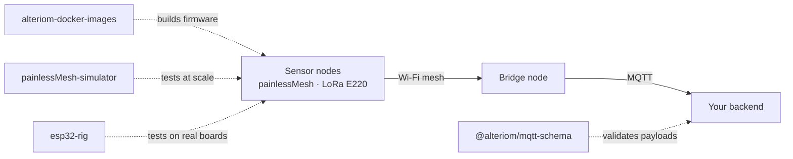

<div align="center">

# Alteriom

**Open-source building blocks for ESP32 mesh networks, IoT telemetry and hardware-in-the-loop testing.**

[Website](https://alteriom.ca) ·
[painlessMesh docs](https://alteriom.github.io/painlessMesh/) ·
[esp32-rig guide](https://alteriom.github.io/esp32-rig/) ·
[Contributing](https://github.com/Alteriom/.github/blob/main/CONTRIBUTING.md) ·
[Security](https://github.com/Alteriom/.github/blob/main/SECURITY.md)

</div>

---

Alteriom builds IoT sensor networks: ESP32 and ESP8266 nodes that talk to each other over a
Wi-Fi mesh and LoRa, and report through MQTT. The parts of that stack that are useful to anyone
building similar systems are open source here, from the mesh library running on the device to the
rig that tests firmware on real boards before it ships.

## 📡 Mesh networking & device libraries

| Project | What it does | Get it |
|---|---|---|
| **[painlessMesh](https://github.com/Alteriom/painlessMesh)**<br> | Self-organising Wi-Fi mesh for ESP32 and ESP8266. Our extended fork adds structured IoT packages (sensor, command, metrics, health, topology), broadcast OTA and an MQTT bridge with automatic gateway failover. | Arduino Library Manager · [PlatformIO](https://registry.platformio.org/libraries/sparck75/AlteriomPainlessMesh) · [npm](https://www.npmjs.com/package/@alteriom/painlessmesh) · [Docs](https://alteriom.github.io/painlessMesh/) |
| **[alteriom-ebyte-lora-e220-library](https://github.com/Alteriom/alteriom-ebyte-lora-e220-library)**<br> | Driver for EByte E220 (LLCC68) LoRa modules, tested on Arduino, ESP8266, ESP32, STM32 and Raspberry Pi Pico (RP2040). | Arduino Library Manager · [PlatformIO](https://registry.platformio.org/libraries/alteriom/Alteriom_EByte_LoRa_E220) · [Docs](https://alteriom.github.io/alteriom-ebyte-lora-e220-library/) |
| **[painlessMesh-simulator](https://github.com/Alteriom/painlessMesh-simulator)** | Runs 100+ virtual ESP32/ESP8266 mesh nodes on a desktop. YAML scenarios for latency, packet loss and partitions let you test mesh behaviour without hardware. | Build from source |

## 📨 Telemetry & integration

| Project | What it does | Get it |
|---|---|---|
| **[alteriom-mqtt-schema](https://github.com/Alteriom/alteriom-mqtt-schema)**<br> | Versioned JSON Schemas, TypeScript types and precompiled Ajv validators for the MQTT payloads our firmware emits: one source of truth between device and backend. | [npm](https://www.npmjs.com/package/@alteriom/mqtt-schema) |
| **[webhook-client](https://github.com/Alteriom/webhook-client)**<br> | TypeScript client for the Alteriom Webhook Connector: typed REST API, HMAC-SHA256 signature verification, Express / Fastify / Next.js adapters. | [npm](https://www.npmjs.com/package/@alteriom/webhook-client) |
| **[alteriom-webhook-client-python](https://github.com/Alteriom/alteriom-webhook-client-python)**<br> | Python SDK for the same service: signature verification, Pydantic models and a FastAPI dependency. | [PyPI](https://pypi.org/project/alteriom-webhook-client/) |

## 🧪 Hardware-in-the-loop testing

A compile-only CI can't tell you what a radio, an OTA update or two boards talking to each other will
do. These repositories let your CI test firmware on real boards.

| Project | What it does | Get it |
|---|---|---|
| **[esp32-rig](https://github.com/Alteriom/esp32-rig)**<br> | A service on a Raspberry Pi beside a bank of real boards. It flashes the bundle your CI built, runs your pytest suite, records every serial line and returns a verdict. Includes a dashboard, an API and a hardware abstraction layer for ESP32, C3, C5, C6, S3 and ESP8266. | [Guide](https://alteriom.github.io/esp32-rig/) · [Releases](https://github.com/Alteriom/esp32-rig/releases) |
| **[esp32-hil-firmware](https://github.com/Alteriom/esp32-hil-firmware)**<br> | The rig's health-check firmware: one image per chip family that proves each board boots, flashes, resets and sees the radio before your suite runs. | [Releases](https://github.com/Alteriom/esp32-hil-firmware/releases) |
| **[esp32-rig-example](https://github.com/Alteriom/esp32-rig-example)** | The smallest project a rig can run: firmware, a three-test suite and the workflow that builds the bundle. Fork it to start your own. | Fork it |

## 🛠 Build & developer tooling

| Project | What it does | Get it |
|---|---|---|
| **[alteriom-docker-images](https://github.com/Alteriom/alteriom-docker-images)**<br> | Pre-built PlatformIO builder images for ESP32, ESP32-C3 and ESP8266 firmware, published to GitHub Container Registry. Runs as non-root by default. | [GHCR](https://github.com/Alteriom/alteriom-docker-images/pkgs/container/alteriom-docker-images%2Fbuilder) |
| **[repository-metadata-manager](https://github.com/Alteriom/repository-metadata-manager)**<br> | Policy-driven repository compliance checks. Remediation goes through plan, approve, apply and verify, so nothing changes without review. | [npm](https://www.npmjs.com/package/@alteriom/repository-metadata-manager) |
| **[ai-dev-skills](https://github.com/Alteriom/ai-dev-skills)** | 28 validated skills for AI coding agents, covering frontend, backend, DevOps and architecture. | Clone it |

## 🧩 How it fits together


```mermaid
flowchart LR
    NODES["Sensor nodes<br/>painlessMesh · LoRa E220"] -- "Wi-Fi mesh" --> BRIDGE["Bridge node"]
    BRIDGE -- "MQTT" --> BACKEND["Your backend"]
    SCHEMA["@alteriom/mqtt-schema"] -. "validates payloads" .-> BACKEND
    BUILDER["alteriom-docker-images"] -. "builds firmware" .-> NODES
    SIM["painlessMesh-simulator"] -. "tests at scale" .-> NODES
    RIG["esp32-rig"] -. "tests on real boards" .-> NODES
```

## ⚡ Quick start

```bash
# Mesh networking on ESP32 / ESP8266 (PlatformIO)
pio pkg install --library "sparck75/AlteriomPainlessMesh"

# Validate device MQTT payloads in Node.js
npm install @alteriom/mqtt-schema ajv

# Build ESP32 firmware without installing a toolchain
docker pull ghcr.io/alteriom/alteriom-docker-images/builder:latest
```

## 🤝 Get involved

- **Found a bug or have an idea?** Open an issue on the relevant repository. The
  [contributing guide](https://github.com/Alteriom/.github/blob/main/CONTRIBUTING.md) explains how
  we work.
- **Have a question about the mesh?** Ask in
  [painlessMesh Discussions](https://github.com/Alteriom/painlessMesh/discussions).
- **Found a vulnerability?** Please report it privately, as described in our
  [security policy](https://github.com/Alteriom/.github/blob/main/SECURITY.md).
- Everyone taking part is expected to follow our
  [code of conduct](https://github.com/Alteriom/.github/blob/main/CODE_OF_CONDUCT.md).

<div align="center">
<sub>Alteriom · Canada · <a href="https://alteriom.ca">alteriom.ca</a></sub>
</div>
